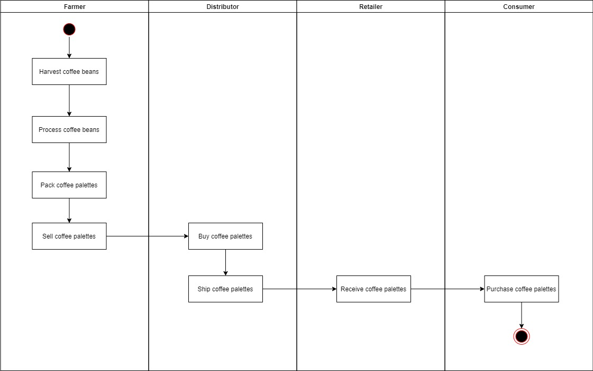
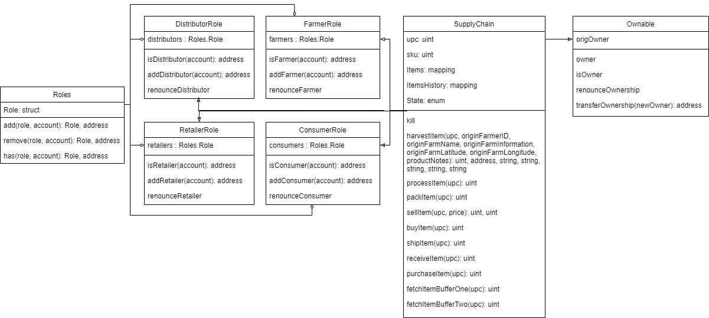

# The contract address

The contracts have been deployed at theese addesses

* Migrations: [Transaction](https://rinkeby.etherscan.io/tx/0x0df1fcbcb3bed9b5c02334c1399acb30bd4b8916970f5b7473656a7bf1e73645) and [Address](https://rinkeby.etherscan.io/address/0xe9ddd1d20c0f08ba3400858402b93b90098096dd)
* FarmerRole: [Transaction](https://rinkeby.etherscan.io/tx/0xbd5a5a16c7b4e22e2641d8bd8d45d2a28ab2abdd0db0ca95383811e9cda57b1c) and [Adress](https://rinkeby.etherscan.io/address/0x7b1ea829dcc381dd2be1381a3a2fe27c7438bf53)
* DistributorRole: [Transaction](https://rinkeby.etherscan.io/tx/0xf4809bd03ae816ba2dfe94598b1d54abe301b31ad3479e70e45af147ef8198bd) and [Adress](https://rinkeby.etherscan.io/address/0xf13927c94be06bda31bac72f4cf0e0c2d2233279)
* RetailerRole: [Transaction](https://rinkeby.etherscan.io/tx/0x708ac51b2d5d61979bda56eaa69c2cde5bbb327d2bb3b1f7a1b37e0dda3252e4) and [Adress](https://rinkeby.etherscan.io/address/0xa5a3b3112f63249662bc00460045ac2c3969d410)
* ConsumerRole: [Transaction](https://rinkeby.etherscan.io/tx/0x929cb4e18a34de99051acb2a604c2e8807fbcf8b388306f0c0b181775ee905a5) and [Adress](https://rinkeby.etherscan.io/address/0xee2c00159d35422f33a192e16acb25deb0aa627c)
* SupplyChain: [Transaction](https://rinkeby.etherscan.io/tx/0x1cb34897af23630d3dc1d6e015a8ab9526c1516a25fcf6aa236bda75918d63f3) and [Adress](https://rinkeby.etherscan.io/address/0xa997b3e2cef002c94050bd9871f23282d37e1a32)

# Used Libraries

* Node.js: Framework used to easily build the Dapp.
* Solidity: Programming language used to programm ethereum contracts.
* Truffle: A suite used to compile, deploy and test ethereum contracts.
* Ganache-cli: Used to emulate a local ethereum network.
* Truffle HDwallet Provider: A wallet provider used to, in our case, connect to infura network.
* Web3.js: A collection of libraries used to interact with ethereum nodes.

# IPFS

Not used

# Program version numbers

* Node.js v6.14.4
* Solidity v0.4.24
* Truffle v4.1.17
* Ganache v6.10.0-beta.2
* truffle-hdwallet-provider v1.0.17
* Web3 v1.2.9

# UML Diagrams

## Activity Diagram

## Sequence Diagram

## State Diagram

## Class Diagram

# Test Executions

All tests passed OK

